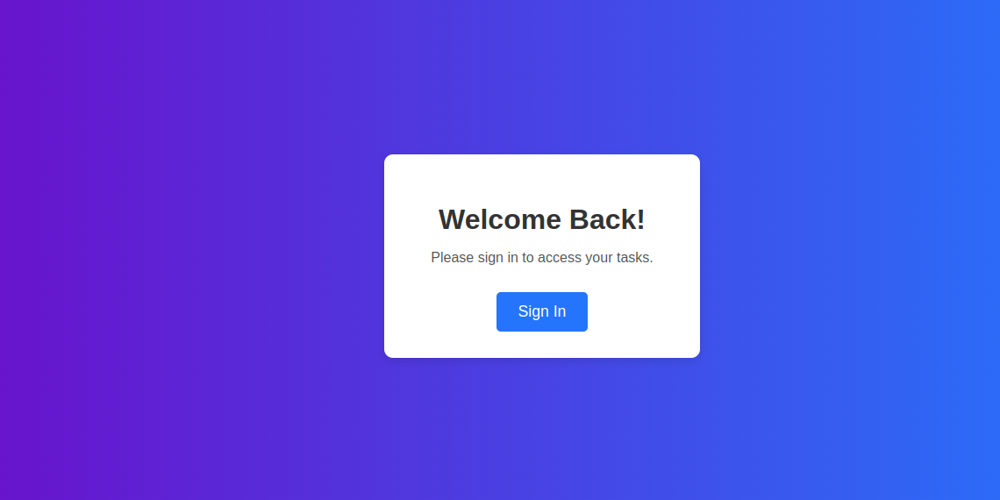
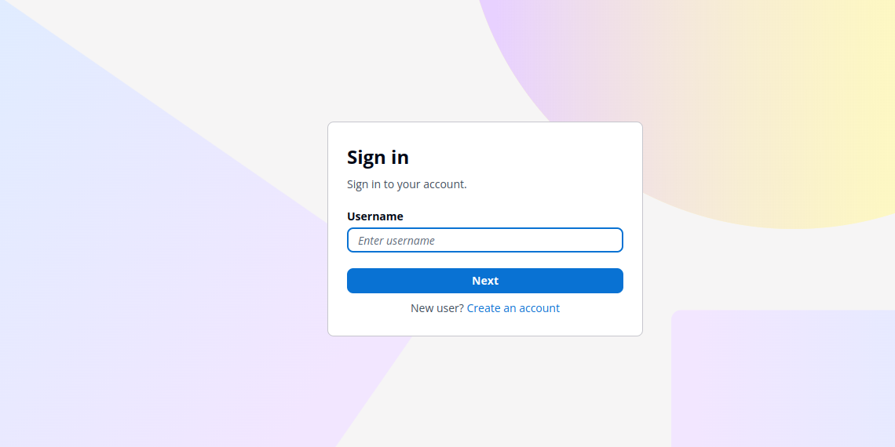
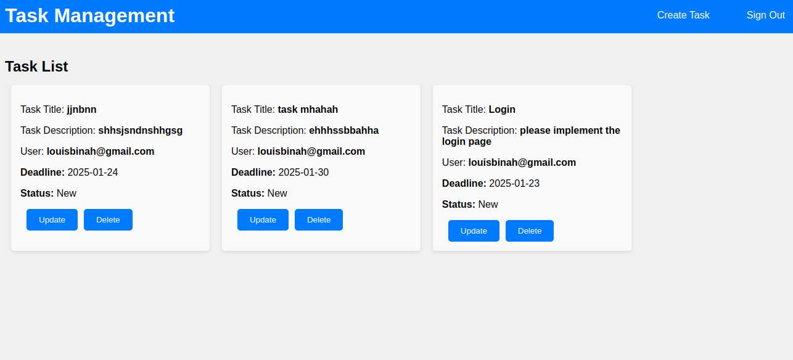
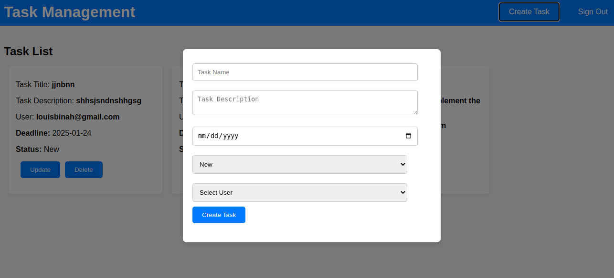
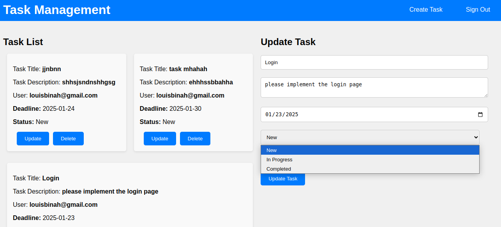
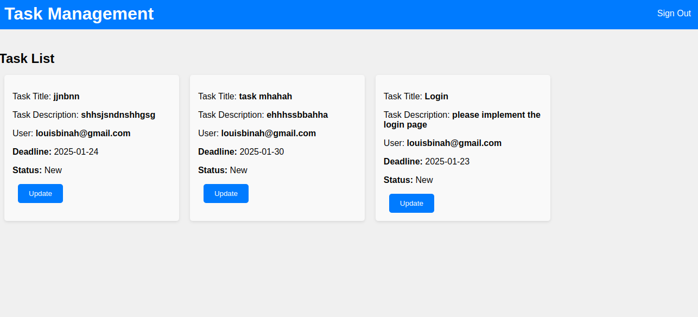
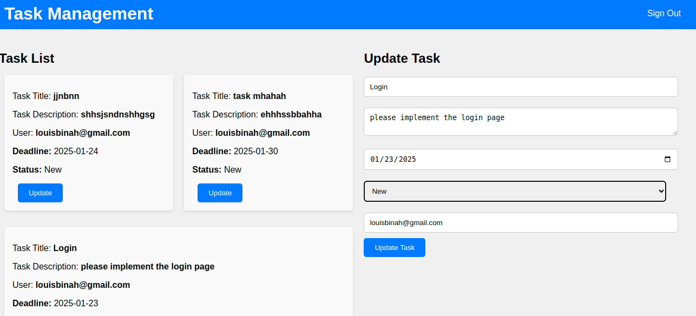

# React + Vite

This template provides a minimal setup to get React working in Vite with HMR and some ESLint rules.

Currently, two official plugins are available:

- [@vitejs/plugin-react](https://github.com/vitejs/vite-plugin-react/blob/main/packages/plugin-react/README.md) uses [Babel](https://babeljs.io/) for Fast Refresh
- [@vitejs/plugin-react-swc](https://github.com/vitejs/vite-plugin-react-swc) uses [SWC](https://swc.rs/) for Fast Refresh

# Task Management System for Field Teams

## Overview

The Task Management System (TMS) is a cloud-based application designed to streamline task assignment, tracking, and management for field teams. Built with AWS serverless services, the system allows an admin to create and assign tasks to team members, while the team members can view, update, and track their tasks. The system ensures seamless workflow management with task notifications, status updates, and deadline tracking.

## Features

- **Admin Capabilities:**
  - Create, assign, and manage tasks.
  - Oversee all team assignments and tasks.
  - Monitor task statuses and deadlines.

- **Team Member Capabilities:**
  - View assigned tasks with details (description, deadline, status).
  - Update task status (e.g., in progress, completed).
  - Receive notifications for task updates and upcoming deadlines.

- **Notifications & Alerts:**
  - Notifications for new task assignments.
  - Deadline reminders and updates.

## AWS Services Used

- **AWS Lambda**: For serverless backend functions such as task creation, updates, and notifications.
- **Amazon API Gateway**: To create and manage REST APIs for communication between the frontend and the backend.
- **Amazon DynamoDB**: A NoSQL database to store tasks, user information, and task updates.
- **Amazon Cognito**: For user authentication (admin and team members).
- **Amazon SES (Simple Email Service)**: To send email notifications to team members about new tasks, status updates, and approaching deadlines.
- **AWS Amplify**: For deploying the frontend and managing continuous delivery workflows.

## Architecture

The system follows a serverless architecture using the AWS services listed above. The backend is powered by AWS Lambda functions, which are triggered via API Gateway requests. DynamoDB handles data storage for tasks, and Amazon Cognito ensures secure user authentication and access control. Notifications are sent through SES to ensure real-time updates via email. The frontend is deployed using AWS Amplify for seamless integration and continuous deployment.

## Getting Started

### Prerequisites

- An AWS account with appropriate IAM permissions to manage Lambda, API Gateway, DynamoDB, Cognito, and SES.
- Node.js and npm installed locally (for deployment and local testing).

### Installation

1. **Clone the Repository:**

   ```bash
   git clone https://github.com/BINAH25/serverless-task-management.git
   cd serverless-task-management

2. **Install Dependencies:**
   ```bash
    npm install

3. **Run the Frontend Locally:**
   ```bash
    npm run dev

4. **Run visit localhost to see the landing page:**
   
   Click on Sign to go to the Login Page


5. **Enter your credential to Login:**
   
    click on Create an account

6. **Admin Interfaces:**
   
   
   

7. **User Interfaces:**
   
   
